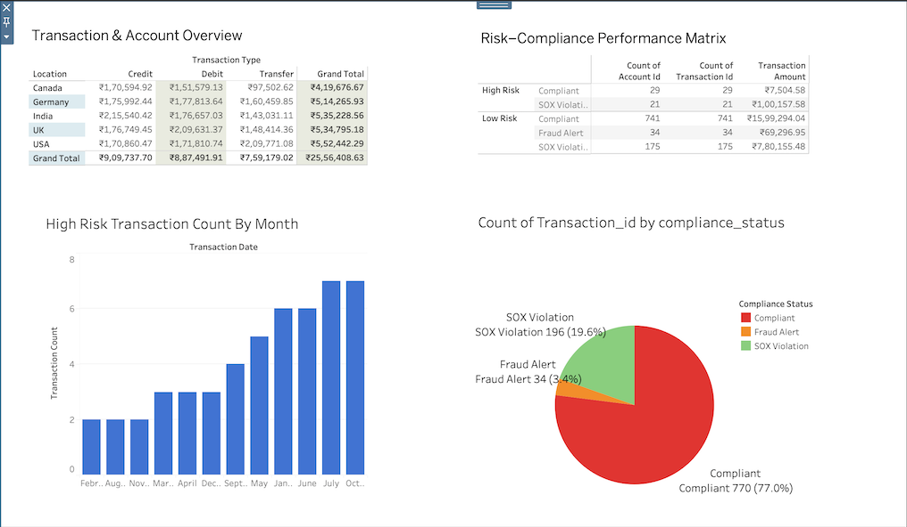

# Audit-Risk-Monitoring-Dashboard-ETL-Python-main

An analytics pipeline for fraud detection, compliance , transactional risk visualization, and audit-tailored insights.

# 🧠 Why This Project Matters
This project exemplifies a comprehensive analytics solution that mirrors real-world enterprise needs—spanning data engineering, risk intelligence, compliance analytics, and interactive reporting. It's built to support internal audit, enterprise risk, and compliance teams with actionable, real-time insights and anomaly alerts.

# 🔍 Project Summary
A full-scale analytics pipeline that automates financial fraud detection, flags compliance violations (SOX/GDPR), and visualizes transactional risk using advanced Power BI dashboards. The system processes raw financial records, applies machine learning for anomaly detection, and delivers visually compelling insights tailored for audit and risk professionals.

# 🚀 Key Features
🔄 ETL Pipeline: Extracts, transforms, and loads financial data using Python (Pandas, NumPy, SQLAlchemy) and SQL.

⚠️ Anomaly Detection: Leverages Isolation Forest to detect suspicious/high-risk transactions.

✅ Compliance Checks: Applies regulatory logic to flag SOX violations.

📈 Interactive Dashboards: Tableau and powerBI interactive dashboards;

Transaction distribution by region & type (Credit, Debit, Transfer)

Risk score and compliance status per transaction

Trends in high-risk activity over time

Breakdown of compliance issues (Compliant, SOX Violation, Fraud Alert)

# 📊 Sample Dashboard Preview

# 💻 Technical Skills Demonstrated

✅ Python & SQL for structured data processing

✅ Machine Learning (Isolation Forest) for anomaly detection

✅ Power BI for interactive dashboards and dynamic visuals

✅ Regulatory Knowledge of frameworks like SOX and GDPR

✅ ETL Best Practices for clean and reproducible pipelines

✅ Automation Skills via OS-level job scheduling

# 📂 Repository Structure

File/Notebook	Description

etl_pipeline.ipynb	Full Jupyter Notebook for ETL logic

financial_transactions.csv	Raw transactional dataset

processed_financial_transactions.csv	Cleaned and structured data

financial_trans.pbix	Power BI dashboard file

README.md	This project documentation

# ⚙️ How to Run

Clone the repository

git clone https://github.com/deepanshurathores1/Audit-Risk-Monitoring-Dashboard-ETL-Python-main

cd Audit-Risk-Monitoring-Dashboard-ETL-Python-main

Install dependencies

pip install pandas numpy sqlalchemy scikit-learn;
Run ETL Notebook

jupyter notebook etl_pipeline.ipynb

Open the Tableau file Use Audit_dashboard.twbx in Tableau to explore the live dashboard.
 
